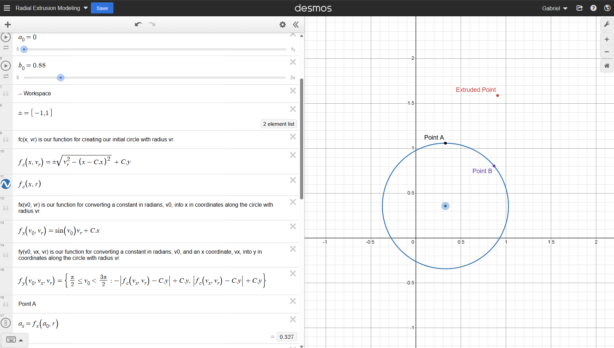

# Data Visualization Showcase

Welcome to my data visualization showcase for Big Five/NEO PI-R personality traits, originally designed to show users their personality results after taking a personality test. ~

This was all hardcoded from the ground up using only vanilla browser functionality (i.e., no libraries were used).

Click the thumbnail below to see a quick preview of interacting with the visualization on YouTube:

[](https://www.youtube.com/watch?v=xWzYo05ajMA)

You can view the derivations I did to model the radial extrusion logic, later implemented in JavaScript, [here on Desmos](https://www.desmos.com/calculator/qxulnwzrwc).



## How to access for yourself

To view the project locally, follow the steps below:

### 1. **Install XAMPP**
   - Download and install XAMPP from [https://www.apachefriends.org/download.html](https://www.apachefriends.org/download.html).
   - (Optional) When prompted, install XAMPP to your desktop.

### 2. **Set up the Project**
   - Navigate to the `xampp/htdocs` directory on your local machine.
   - Delete all files in this directory to ensure a clean setup.

### 3. **Clone the repository**
   - Clone this project into the `xampp/htdocs` directory by running:
     ```bash
     git clone https://github.com/gabetucker2/DataVisualization.git
     ```

### 4. **Start the Apache server**
   - Open the XAMPP Control Panel.
   - Click the "Start" button in the `Apache` row to launch the server.

### 5. **Access the project**
   - Open your web browser and type `localhost` in the address bar.
   - You should see a hyperlink with the name of this project. Click on it to access the visualization.

### 6. **Enjoy!**
   - Explore the interactive visualizations for data that randomizes on each refresh.
   - Left click to trigger a personality factor and its faucets on/off upon leaving cursor hover.
   - When you are finished, remember to press "Stop" in your XAMPP Control Panel in the `Apache` row.

## Technologies Used

- **JavaScript** (for bulk of visualization logic)
- **HTML/CSS/PHP** (for web-based application infrastructure)
- **Desmos** (for mathematical modeling)
- **XAMPP/Git** (for local development)
